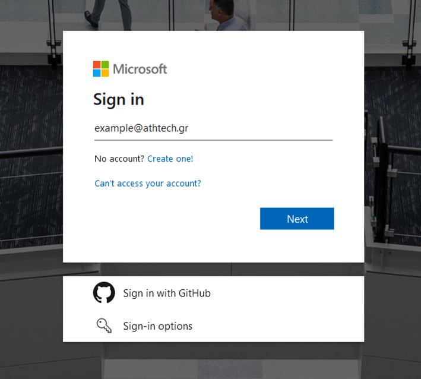
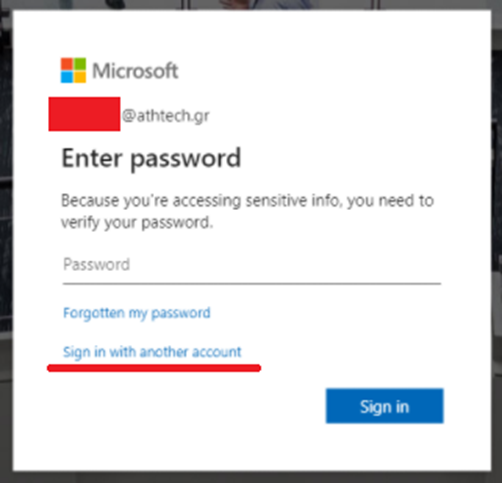
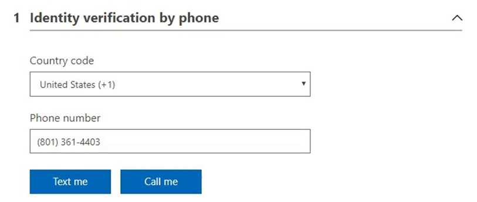
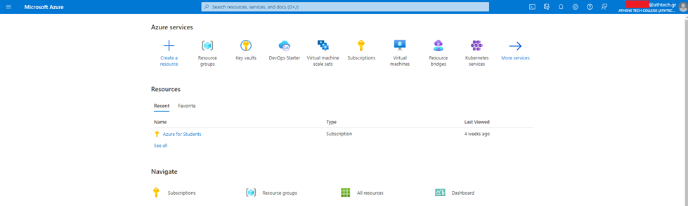
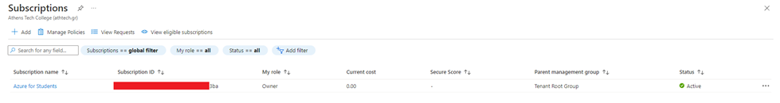

# Instructions for creating an educational Azure Account

In order to follow the course(s), you will need to have credits in your Azure account. One of the easiest ways to obtain these credits is by applying for an Azure for Students subscription through the following [link](https://azure.microsoft.com/en-us/free/students/
).

## Required Setup
- Academic E-mail OR
- AthTech E-mail

## Step-by-step

1. Head to the link and click on the "Start Free" button:

2. There are two cases that may happen:

    - You are not logged in and you will be required to sign in with your academic account:
     
   
   
    - You are already logged in with another account. Sign out of that account and use your academic account:
   
   

3. After signing in, you will be requested to input your country of residence and a phone number. Input your real phone number as Azure will verify it.\

Note 1: ****Use a unique phone number, do not reuse a phone number that has been used for the creation of another Azure Account (whether that is trial or not). Same applies for the secondary e-mail.****
Note 2: If the end of the subscription has been reached (because you activated the trial sometime in the past for the same account), you can also renew (extend) the subscription and you will start anew.

4. Follow all the steps and finish the registration. Afterwards, head to the following [link](https://portal.azure.com/) (Azure Portal).

5. On top of the Portal page, within the search bar, write Subscriptions and click on it:

6. Within the page, you should be able to see an “Azure for Students” subscription which should be active:

