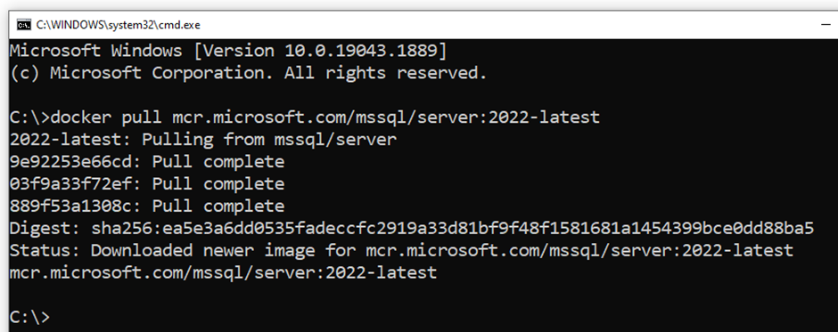

# Starter Kit for AZ-204 : Developing Solutions for Microsoft Azure
Here are the development tools **required** to enable you
to start.

1.  **[Visual Studio Community Edition](https://visualstudio.microsoft.com/vs/community/)**

During the installation select the workloads shown in red, below:


2.  [VS Code](https://code.visualstudio.com/)

## Docker

Docker installation instructions can be seen [in this link](https://docs.docker.com/desktop/install/windows-install/). If you do not want to study the instructions there, we have summarized the process that you need to follow in the next steps. The process will require administration access during many of the steps described here.

1. Download **Desktop Docker for Windows**

2. Run the Docker installer. **You will need administrator access for this step**.

3. The installer will give the option of “**Use WSL 2 instead of Hyper-V**” on a configuration page which it will show you. You **MUST** select the option of “Use WSL 2…”.  Because of this, the installer will install WSL 2, the Windows Subsystem for Linux. **You might need administrator access for this step**.

4. The installer will perform one or more restarts during installation. Once again, after your machine restarts **you might or might not be asked to need administrator access one more time for the installation to complete**.

5. When the installer is complete, you need to add your Windows name to a user group which can control Docker. To do so, start the **command prompt tool with administrator rights**. The folder/directory that you are in is not important. Simply type in the following command in it, **by replacing <user_name> with your Windows user name**
   ```
   net localgroup docker-users <user_name> /add
   ```                                                   


6.	When you run the above command, if you happen to get ‘System error 1378’ that ‘The specified account name is already a member of the group', **that is ok**, you do not need to worry.

7. You should now be able to start Docker Desktop from the start menu.

### Install MS SQL Server 

To install the MS SQL Server inside Docker, you need to open a command prompt. Administrator rights are NOT needed. The folder/directory that you are in is not important. Type in the following command and wait for the installation to complete (approximately 700 MB).
   ```
    docker pull mcr.microsoft.com/mssql/server:2022-latest
   ```    


The MS SQL Server installation is complete inside Docker, but you will not be able to connect to it yet because you will need to create some user credentials for the server. This connection process will be shown to you during the first training session.

### Install MS SQL Server Management Studio (SSMS)

Download the installer for SSMS from this [link](https://aka.ms/ssmsfullsetup).

1. Run the SSMS installer that you downloaded from above. You will need administrator access for this step.
2. It is possible that the installer will ask you to restart the machine. Let it do so. When the machine restarts, you will need to run the installer once again.
3. Once the installer completes, SSMS is ready to use. You can run SSMS from the start menu. The way to connect will be shown to you during the first training session.
