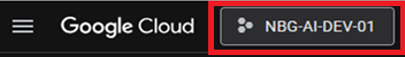
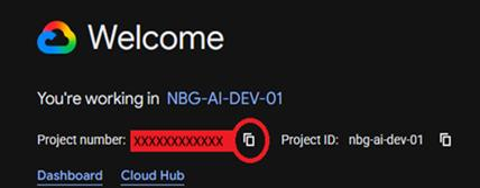
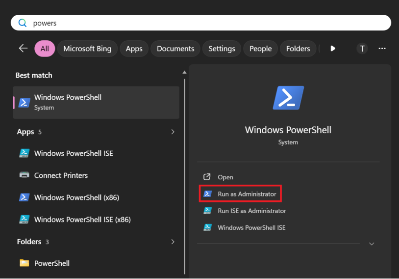

# Hardware and software requirements for Claude in Action

&nbsp;
&nbsp;

## Workstation specifications

- Windows 11 or Linux or MacOS, 64-bit
- RAM, 16GB required, 32GB preferable
- 128 GB Storage (SSD would be preferable)
- 4 Core CPU

## Prerequisites

Before getting started, make sure you have the following installed and set up:

1. **[Claude Code](https://claude.com/download)**.
   Download and install the Claude Code desktop application.
1. **[Node.js LTS](https://nodejs.org/en/download/current)**.
   Install the latest Long-Term Support version of Node.js.
1. **[Docker Desktop](https://www.docker.com/products/docker-desktop/)**.
   Used for running tools and MCP servers in isolated containers.
   > **Optional:** Only required if you plan to install a tool or MCP server that runs in an isolated container or depends on additional
   services and software.
1. **[Git](https://git-scm.com/downloads)**.
   Version control system required for managing your projects.
1. **[GitHub Account](https://github.com/join)**.
   Create a free account if you don't already have one.
1. Your preferred programming language environment. Since this workshop involves generating and running code, make sure your language
   runtime, package manager, and any relevant tools are installed and working. Examples: Java + Maven/Gradle, Python + pip/uv, .NET SDK,
   Ruby + Bundler, Node.js + npm/yarn, etc.

> **Note:** Skip any items you already have installed or set up.

## Getting Claude Code Running for the First Time

### Request GCP Profile

Make sure your GCP profile has been requested and approved via IAM for your unit.

### Find Your Project Number

Go to https://console.cloud.google.com and log in with your corporate credentials.
<br><br>


Click the project selector (top-left), choose your project, then copy the Project Number from the welcome screen.



### Set Environment Variables

Open PowerShell as Administrator:


Run these commands in order. Replace XXXXXXXXXXXXX with your Project Number.

```Powershell
[System.Environment]::SetEnvironmentVariable("CLAUDE_CODE_USE_VERTEX", "1", "User")

[System.Environment]::SetEnvironmentVariable("ANTHROPIC_VERTEX_PROJECT_ID", "ΧΧΧΧΧΧΧΧΧΧΧΧΧ", "User")

[System.Environment]::SetEnvironmentVariable("CLOUD_ML_REGION", "europe-west1", "User")

[System.Environment]::SetEnvironmentVariable("ANTHROPIC_MODEL", "claude-sonnet-4-6@default", "User")
```

Close PowerShell.

## Every-Day Usage

### Open PowerShell as Admin

Search for PowerShell in the Start menu, right-click Windows PowerShell, and select Run as Administrator.

### Authenticate with GooglAuthenticate with Google

Run the following commands in order:

```Powershell
Set-ExecutionPolicy -Scope Process -ExecutionPolicy Bypass

gcloud auth application-default login
```

A browser window will open. Log in with your corporate Google credentials. You will need to repeat this step when the session expires.

### Launch Claude Code

After authentication completes, run `claude`. That is it. Claude Code is now running.

### Support

For issues or questions, contact IT Support:

**wpadmins@nbg.gr**<br>
Subject: Claude Code Issue

## Get Ready for the Training

Visit the [NBG AI Hub](https://556lowcodenocode.github.io/NbgAiHub/) for more information.

Take some time to explore [**Open Foundations**](https://556lowcodenocode.github.io/NbgAiHub/start-here/foundations/) and
[**Day 1 setup**](https://556lowcodenocode.github.io/NbgAiHub/start-here/day-1/) for an early look at what the training covers. Optionally,
feel free to browse through all the material available on the NBG AI Hub. You can always come back to it, as the content is continuously
kept up to date.
