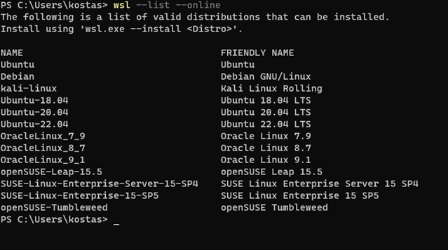
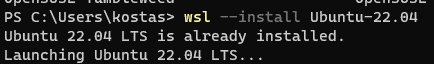
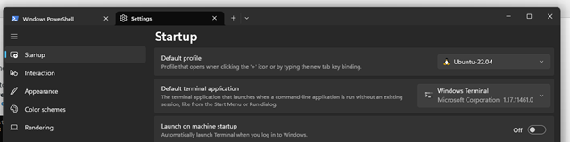

# Installation requirements for DevOps
Getting your system ready for the DevOps module.
&nbsp;
&nbsp;

## Hardware specifications
- Windows 10, Linux or MacOS, 64 bit
- RAM, 8GB required, 16GB is recommended
- 30 GB of free disk space, use of SSD is recommended

## Software Stack
1. Download and install **[Git Version Control](https://git-scm.com/downloads)**.
2. Download and install **[Visual Studio Code](https://code.visualstudio.com/)**. Needed as a code editor.
3. Download and install **[Docker](https://www.docker.com/products/docker-desktop)**. Depending on your hardware or operating system, Docker might ask you to enable CPU virtualization support and install Windows Subsystem for Linux, WSL. All you need to do for these is to simply follow the instructions that Docker will give you. **For detailed instructions, please check below**.
4. Download and install WSL. **For detailed instructions, please check below**.

## User accounts in the following websites
1. Create a **[GitHub account](https://github.com/join)**.
2. Create an **[Azure Student account](https://azure.microsoft.com/en-us/free/students/)**. Go to the link that is given here, click on 'Start free', provide your AthTech credentials and follow the instructions. You will be asked for some information, including a mobile phone number which must not linked to another student account. You will NOT need to provide credit card details - if you are asked for credit card details then you have followed an incorrect link. For a step by step guide, please follow this **[link](https://github.com/codehub-learn/development-environment-setup/blob/main/Azure_Student_Trial.md)**.
3. Create a **[Docker Hub account](https://hub.docker.com/)**.


## Detailed Instructions

### Docker

Docker installation instructions can be seen [in this link](https://docs.docker.com/desktop/install/windows-install/). If you do not want to study the instructions there, we have summarized the process that you need to follow in the next steps. The process will require administration access during many of the steps described here.

1. Download **Desktop Docker for Windows**

2. Run the Docker installer. **You will need administrator access for this step**.

3. The installer will give the option of “**Use WSL 2 instead of Hyper-V**” on a configuration page which it will show you. You **MUST** select the option of “Use WSL 2…”.  Because of this, the installer will install WSL 2, the Windows Subsystem for Linux. **You might need administrator access for this step**.

4. The installer will perform one or more restarts during installation. Once again, after your machine restarts **you might or might not be asked to need administrator access one more time for the installation to complete**.

5. When the installer is complete, you need to add your Windows name to a user group which can control Docker. To do so, start the **command prompt tool with administrator rights**. The folder/directory that you are in is not important. Simply type in the following command in it, **by replacing <user_name> with your Windows user name**
   ```
   net localgroup docker-users <user_name> /add
   ```                                                   


6.	When you run the above command, if you happen to get ‘System error 1378’ that ‘The specified account name is already a member of the group', **that is ok**, you do not need to worry.

The installation is over and you should now be able to start Docker from the start menu.

### WSL

1. Run the following command in a Windows Powershell window:
```
   wsl -list -online
```


2. Select Ubuntu for our distribution to be installed.
```
   wsl -install Ubuntu-22.04
```


3. If you open a new Windows Terminal, you should now be able to select Ubuntu.

4. If Ubuntu is not visible in your Windows Terminal, please open Settings and set it as default Terminal Profile (if you wish to do so).
   

