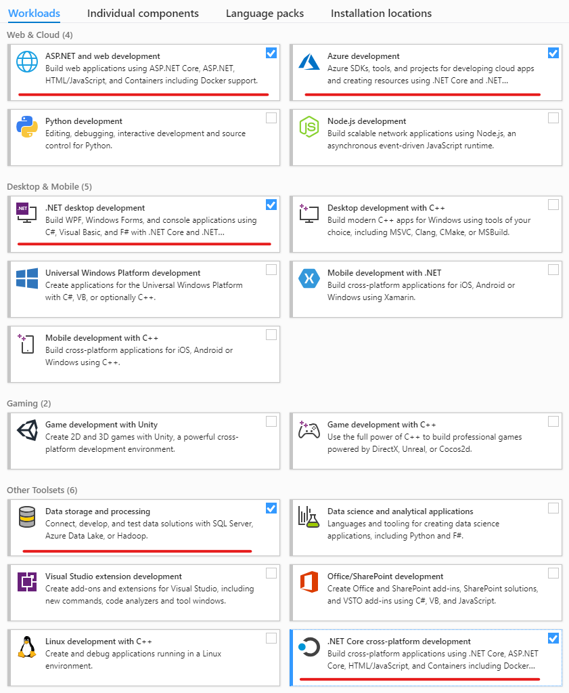

# How to set up your PC for a .NET Training
Here are the development tools **required** to enable you
to start coding on a .NET Training.

## .NET Development Tools

1.  **[Visual Studio Community Edition](https://visualstudio.microsoft.com/vs/community/)**

During the installation select the workloads shown in red, below:



2.  [VS Code](https://code.visualstudio.com/)

## Database development

1.  SQL Server Local Installation OR [SQL Server (Docker image)](https://docs.microsoft.com/en-us/sql/linux/quickstart-install-connect-docker?view=sql-server-ver15&pivots=cs1-bash#pullandrun2019)
        - First **[Docker](https://github.com/codehub-learn/development-environment-setup/blob/main/docker.md)** and **[CMDer](https://cmder.app/)**
        - Open cmder and run the following command: 
        ```bash
        docker run -e "ACCEPT_EULA=Y" -e "SA_PASSWORD=admin!@#123" -p 1433:1433 --name sql1 -d mcr.microsoft.com/mssql/server:2019-CU3-ubuntu-18.04
        ```
        - A new SQL Server instance will be created and you can access it using SQL Server Management Studio by using:
    
            Server name: `localhost`
    
            Authentication: `SQL Server authentication`
    
            Username: `sa`
    
            Password: `admin!@#123`

3.  [SQL Server Management Studio](https://docs.microsoft.com/en-us/sql/ssms/download-sql-server-management-studio-ssms?view=sql-server-ver15) 
    **or** [Azure Data Studio](https://docs.microsoft.com/en-us/sql/azure-data-studio/download-azure-data-studio?view=sql-server-ver15)

## Other development tools

1. **[Github account](https://github.com/join)**
2. **[Git Version Control](https://git-scm.com/downloads)**
3. **[Docker](https://github.com/codehub-learn/development-environment-setup/blob/main/docker.md)**
4.  [Postman Client](https://www.postman.com/downloads/)
5.  [CMDer (or any **good** console emulator)](https://cmder.app/)
