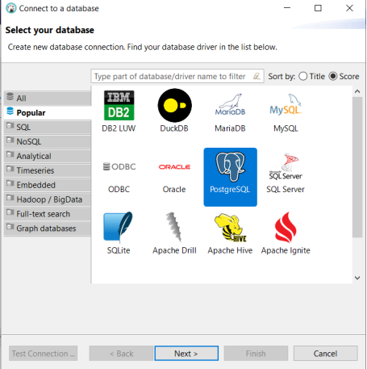
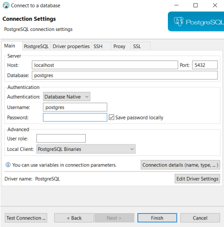

# Hardware and software requirements for Java & Spring framework development, React and PostgreSQL on Docker
&nbsp;
&nbsp;

## Java & Spring

### Workstation specifications
- Windows 10 or Linux or MacOS, 64 bit
- RAM, 8GB required, 16GB preferable
- 128 GB Storage (SSD would be preferrable)
- 4 Core CPU

### Development IDE
**[Download IntelliJ IDEA Ultimate](https://www.jetbrains.com/idea/download/#section=windows)** and install. In case you already have it installed and your license has expired, we will provide you a valid license for the duration of the course. In case you prefer using another IDE, that's also fine as the examples do not make use of any IDE specific functionality.

### Java Development Tools
1. Java Development Toolkit, download and install the latest LTS version **[JDK 17](https://bell-sw.com/)**. Create then an environmental variable named **JAVA_HOME** pointing to JDK installation folder.
2. Maven, download **[Maven](https://maven.apache.org/download.cgi)** and follow the **[instructions](https://maven.apache.org/install.html)**. Through Maven dependency management mechanism, we will download every library needed in our projects.  Create then an environmental variable named **MVN_HOME** pointing to Maven's installation folder.
3. Add **%JAVA_HOME%\bin** and **%MVN_HOME%\bin** to your **PATH** envrionmental variable.

### Other tools
1. Download and install **[Git Version Control](https://git-scm.com/downloads)**.
2. Create a **[Github account](https://github.com/join)**.

## React

### System Requirements

Before starting please make sure that you have successfully installed the below dependencies on your development environment.

- The latest **LTS** version of [Node.js](https://nodejs.org/en/) - Node.JS is a JavaScript runtime built on Chrome's V8 JavaScript engine.
- [npm](https://www.npmjs.com/) - is the official Nodejs Package Manager (npm) which allows the management of dependencies and packages. It is automatically installed with nodejs, so you don't have to install it separately.
- [git](https://git-scm.com/) / [GitHub account](https://github.com/) - is a version control system for source code and GitHub is a community site that enables the easy creation and collaboration on Git projects.

### Verifying installation

After installing node please verify that you have set up everything correctly by typing the below commands on your terminal:

- `node -v` ➡️ (any version above or equal 17 is fine),
- `npm -v` ➡️ (any version or equal 7 is fine).

### Code editor

Feel free to use any IDE you like. **However, [VS Code](https://code.visualstudio.com/) is the recommended IDE** since it is light-weight, has a tone of extensions/plugins, and it is an industry standard.

VS Code will be used within class with the following extensions:

- [Babel JavaScript](https://marketplace.visualstudio.com/items?itemName=mgmcdermott.vscode-language-babel)
- [ESLint](https://marketplace.visualstudio.com/items?itemName=dbaeumer.vscode-eslint)
- [npm Intellisense](https://marketplace.visualstudio.com/items?itemName=christian-kohler.npm-intellisense)
- [Path Autocomplete](https://marketplace.visualstudio.com/items?itemName=ionutvmi.path-autocomplete)
- [Path Intellisense](https://marketplace.visualstudio.com/items?itemName=christian-kohler.path-intellisense)
- [Prettier - Code formatter](https://marketplace.visualstudio.com/items?itemName=esbenp.prettier-vscode)

## PostgreSQL (with Docker)

### Required Setup

- Docker
- PostgreSQL
- DBeaver

### Install Docker

Docker installation instructions can be seen in this [link](https://docs.docker.com/desktop/install/windows-install/). If you do not want to study the
instructions there, we have summarized the process that you need to follow in the next
steps. The process will require administration access during many of the steps described
here

1. Download **Desktop Docker for Windows installer** (approximately 540 MB).
2. Run the Docker installer. **You will need administrator access for this step**.
3. The installer will give the option of “**Use WSL 2 instead of Hyper-V**” on a configuration page which it will show you. You **MUST** select the option of “Use WSL 2…”. Because of this, the installer will install WSL 2, the Windows Subsystem for Linux. **You might need administrator access for this step**.
4. The installer will perform one or more restarts during installation. Once again, after your machine restarts **you might or might not be asked to need administrator access one more time for the installation to complete**.
5. When the installer is complete, you need to add your Windows name to a user group which can control Docker. To do so, start the **command prompt tool with administrator rights**. The folder/directory that you are in is not important. Simply type in the following command in it, **by replacing <user_name> with your Windows user name**: _net localgroup docker-users <user_name> /add_

6. When you run the above command, if you happen to get ‘System error 1378’ that ‘The specified account name is already a member of the group', **that is ok**, you do not need to worry.

The installation is over, and you should now be able to start Docker from the start menu; do so because it is needed for the **next installation**.

### Install PostgreSQL

To install PostgreSQL, once you have installed Docker, type in the following command on the command prompt

_docker run --name some-postgres -p 5432:5432 -e POSTGRES_PASSWORD=mysecretpassword -d postgres_

You can change POSTGRES_PASSWORD to whatever you want, and it will be the password that you will be using in the later stages of this process.

### Install DBeaver

Download DBeaver Community 21.0.4 from Software on Demand. Install it as usual with all other Software on Demand installations.

### Connect DBeaver to PostgreSQL

Once you start DBeaver, it will ask you to connect to a database; select PostgreSQL.

Depending on your machine configuration, the installer might ask you to download driver files (but if your machine already has them, you will not be asked this). Next the connection setup window will appear. Leave the username as ‘postgres’ and enter the password you used in the Docker installation for PostgreSQL.

Click on ‘Test Connection” to confirm that DBeaver can see the database. Once you get the success message, the setup is complete.

