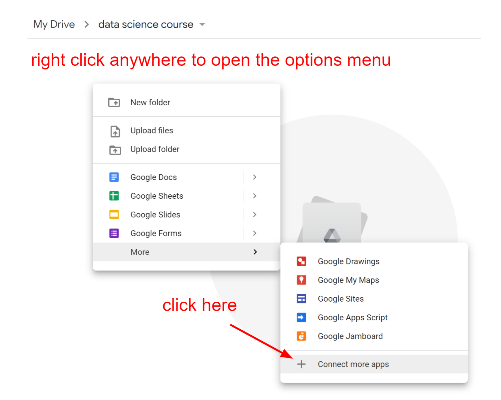
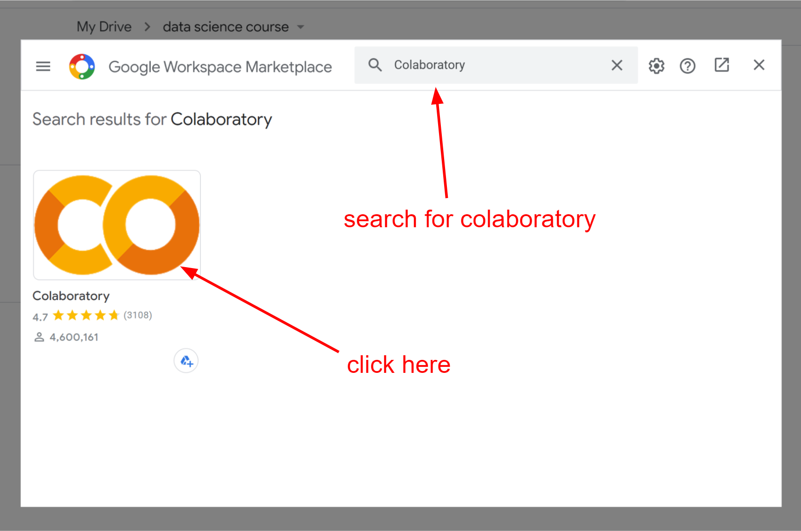
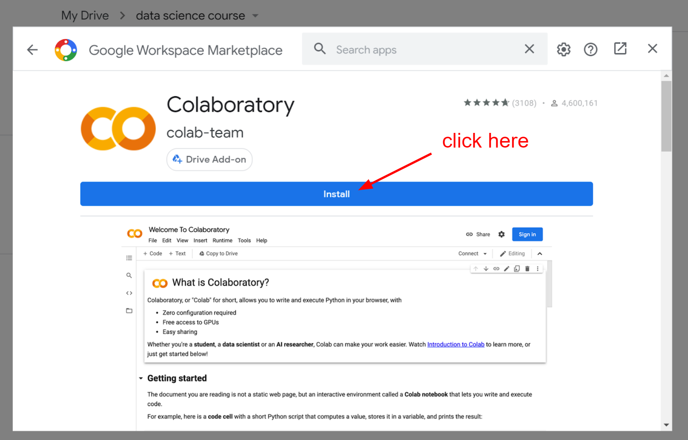
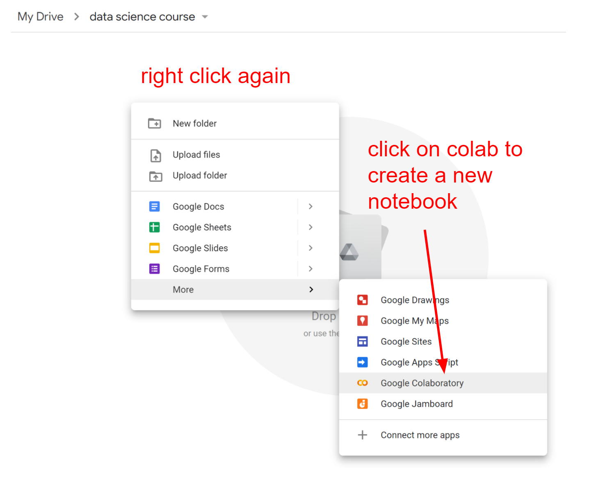
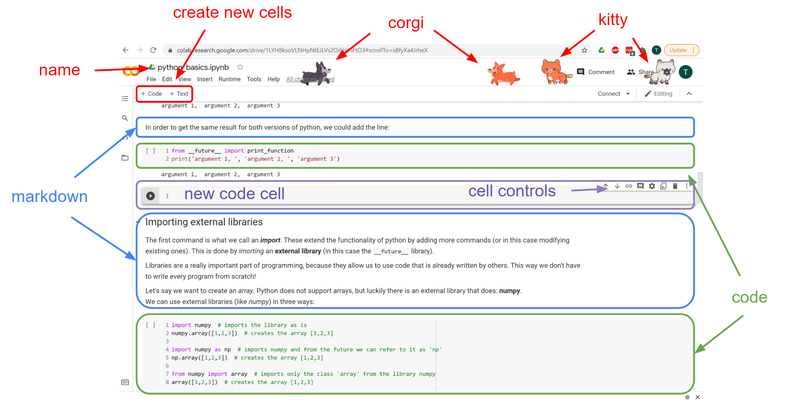

# Starter Kit and Resources for Python

## Recommended Setup

[Python](https://www.python.org/): download and install the latest version for you operating system.

## How to set up your PC

This course will mostly be done on Jupyter Notebooks. There are two ways to use this tool: locally or online. 

### Online

There are several online providers for hosting Jupyter notebooks. We recommend using **Google Colaboratory**.

Google Colaboratory is a cloud service that lets you create and edit python notebooks through the browser. You may write blocks of code (cells) and run them to get the output immediately, as well as cells of text (markdown) embedded with images, Latex etc. Also, you can install any python library you need, although most of them are already installed.

**Requirement**: google account (your gmail)

You can try it out [here](https://colab.research.google.com/notebooks/intro.ipynb)!

We recommend using it through your google drive. You can set it up like this:

1. Sign in to your google account and visit your google drive.
2. Create a folder that will contain the notebooks that we will use in this course.
3. Connect colaboratory add-on to your google drive.

4. Either upload an existing notebook and open it with colab or create a new one

#### Pros:
- Environment is already setup, no need for installations/configurations.
- Pip and commonly used libraries are preinstalled.
- Processing is offloaded to a remote server, no need for computational power from your end.

#### Cons:
- Requires an internet connection.
- Slower than running it locally (in most cases).
- Data need to be uploaded to colab (or google drive).

#### Quickstart

- Add a new code or text cell by clicking on the "+ Code" or "+ Text" button under the Menu bar
- Write a python command on a code cell (e.g. print ("hello world) )
- Run it by clicking the "play" button on the left of a code cell or by clicking Shift+Enter 
- To run an os command add "!" in the beggining (e.g. !pip3 list)
- Double-click on a text cell (markdown) in order to edit it
- You can use a GPU by selecting "Runtime -> Change runtime type" and setting the "Hardware accelerator"
- To upload a file to colab, click on the "Files" tab on the left, then click "Upload" and select a file
- You may also click on "Mount Drive" to get access to all your files on drive
- Install a python library using pip3 (e.g !pip3 install --upgrade scikit-learn)
- Import a library (e.g. import pandas)
- Download your code as a python file by selecting "File -> Dowload .py"
- Restart kernel (reset all variables) by selecting "Runtime -> Restart runtime..."

### Locally (for Windows)

1. Download and install [python](https://www.python.org/downloads/) (preferably python > 3.7). 
    - We do **not** recommend using other python distributions (e.g. anaconda). 
    - During installation, **add python to your environmental variables**. That means that you have to check the box saying **ADD TO PATH** on the first screen during the installation
    - If prompted select to additionally install pip.  
2. Verify that python is installed.
    - Open a command prompt and type the command for launching a python interpreter. Depending on the OS and python's version this can either be `python`, `python3`, `py` or `py3`.
    - If none work, you need to add python to your environmental variables manually. To do this, find the interpreter in the installation directory and [add it as an environmental variable](https://www.computerhope.com/issues/ch000549.htm).
    - From now on we'll consider that python is installed and works with the command `python`. If this differs in your PC, use your own instead of `python` from now on.
3. Verify that pip is installed.
    - Pip is a package manager for Python.
    - Open a command prompt and type the command `pip`.
    - If it doesn't exist type `python -m pip`. If this works, you can add pip to your environmental variables (look above on how to do this). `
    - If pip isn't installed, download the installer from [here](https://bootstrap.pypa.io/get-pip.py) and run it as a python scripy: `python get-pip.py`.
4. Upgrade pip by running `pip install --upgarade pip` or `python -m pip install --upgrade pip`.
5. Packages required during this course can be installed using the pip package manager. Either `pip install package-name` or `python -m pip install package-name`. Any package that is required will be pointed out in class.

### Locally (other OS)

Install python and pip through the OS's default package manager. Then run step 4 from before.

*Note: Most linux and OSX distributions have Python 2 preinstalled. This is not compatible with what we will be seeing in this course. Either install Python 3 locally, or use the online tool described above!* 

## Development IDE
**[Download PyCharm](https://www.jetbrains.com/pycharm/)** and install.

## Other tools
1. Git, download and install **[Git Version Control](https://git-scm.com/downloads)**
2. Create a **[Github account](https://github.com/join)**

